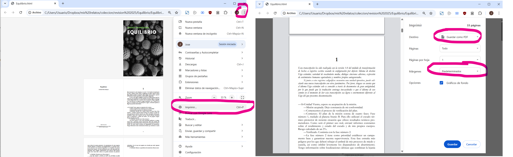
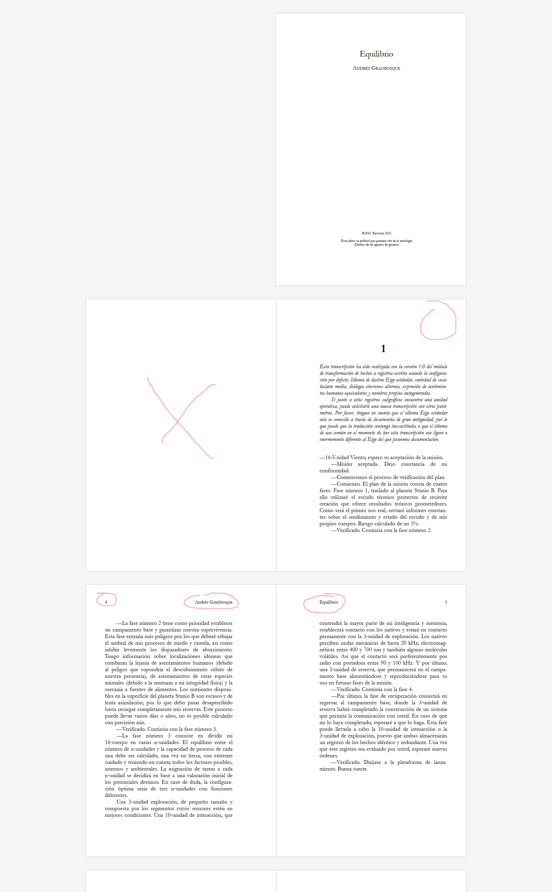

# md-to-ebook

Este repositorio contiene una serie de scripts y utilidades para convertir un archivo markdown a:

- epub

- pdf para visualizar en pantalla

- pdf listo para imprimir


# Introducción

Estas utilidades muestran el proceso que yo sigo para maquetar libros en diferentes formatos a partir de un único archivo de texto.

Partimos de que el documento original esté en formato Markdown. Si no conoces markdown, puedes empezar por esta guía básica: [Guía de Markdown en programminghistorian.org](https://programminghistorian.org/es/lecciones/introduccion-a-markdown)

## ¿Qué es Markdown?

Markdown es un formato de texto plano con marcas sencillas para títulos, cursiva, negrita, listas, etc. No guarda la apariencia, solo una estructura mínima. Así puedes escribir centrándote en el texto y sin preocuparte de cómo se verá después.

Lo puedes editar con multitud de programas (es texto plano, el mismo bloc de notas sirve).


Ejemplo mínimo:
```markdown
---
title: Mi libro
author: Nombre Apellido
lang: es-ES
cover-image: portada.jpg
---

# Capítulo 1

Texto con cursiva (por ejemplo, *así*) y con negrita (por ejemplo, **así**).


# Capítulo 2

Los capítulos se marcan con una almohadilla.

Los párrafos se separan con una línea en blanco. 

***

Los tres asteriscos que hay encima de este párrafo indican una separación de sección.


```


Hay multitud de editores para todos los sistemas operativos. Más abajo incluyo enlaces para algunos, pero puedes también echar un vistazo y experimentar aquí:

[https://markdownlivepreview.com/](https://markdownlivepreview.com/)


## ¿Por qué usar markdown?

Resumen: permite tener el texto limpio con el formato mínimo y que no dependa de la visualización o aspecto. Generalmente para relatos, novelas u obras de ficción se necesita un formato realmente mínimo: indicar los títulos y secciones, cursiva y poco más. Raramente se usará negrita, subrayado, colores... En cualquier caso markdown nos permite separar el contenido de la presentación. 

En nuestro documento markdown solamente tendremos el texto y esos indicadores mínimos. No se incluirá el tipo de letra, espaciado entre párrafos, interlineado, sangrías... Solamente al generar el fichero final, se aplica ese formateado a partir de una plantilla, que se podrá cambiar en cualquier momento.

De esta forma puedes centrarte en el texto sin preocuparte del aspecto. Puedes reutilizar la misma plantilla para otras obras. Si necesitas corregir alguna errata, puedes corregirla en el documento original y luego volver a generar los epubs y pdf sin tener que modificar manualmente cada uno de ellos.

Además, si convertimos desde un procesador de textos (Word, LibreOffice, etc) a epub, normalmente se incluyen muchas marcas de formato innecesarias (especialmente sobre el interlineado, párrafos...) que pueden acabar estropeando la visualización en ereaders.

Puede ser especialmente útil si quieres trabajar con textos de diferentes fuentes o autores, para unificar el formato.

A mí me resulta cómodo trabajar con mis textos en markdown, mejor que con un procesador de textos, aunque suelo usarlos en combinación (porque también me gusta la corrección ortográfica o utilidades de otros programas). A fin de cuentas se trata de preferencias personales, pero lo que sin duda me resulta práctico es que, una vez terminado el texto, usar md para generar los epubs y pdfs sin pelearme por la apariencia.


# Requisitos

Antes de ponernos en marcha hay que instalar unas cuantas cosas. Esta guía es para Windows, pero si usas otro sistema, como Linux, seguramente sepas cómo hacerlo y es incluso más fácil.

## 1. Descarga esta guía y utilidades

Puedes descargar este repositorio completo como archivo zip desde GitHub:

**[Descargar md-to-ebook.zip](https://github.com/granbosque/md-to-ebook/archive/refs/heads/main.zip)**

**Alternativa con Git:**
Si tienes Git instalado, también puedes clonar el repositorio:
```bash
git clone https://github.com/granbosque/md-to-ebook.git
```

Una vez descargado, extrae el contenido en una carpeta. El listado de archivos que tendrás es:

- Readme.md: este documento
- epub.css: hoja de estilos para generar epub
- pdf.css: hoja de estilos para generar un pdf para visualizar
- print_pdf.css: hoja de estilos para generar un pdf imprimible
- template.html: plantilla para generar los pdf. (Para epub usaremos la plantilla estándar de pandoc, pero para pdf, incluyo esta con un par de personalizaciones)
- build_epub.bat, build_pdf.bat y build_print_pdf.bat: utilidades para generar esos formatos.
- docx_to_md.bat: por si quieres convertir un archivo de word a markdown.
- ejemplo.md: archivo de ejemplo para hacer pruebas y que veas cómo trabajar con este formato

## 2. pandoc (imprescindible)

pandoc es una utilidad (código abierto) para convertir entre numerosos formatos de texto. Esto es lo que usaremos para

- Generar EPUB

- También para convertir desde docx (formato de Word) o cualquier otro a markdown

Se puede descargar e instalar desde aquí:

- [Descargas de Pandoc (Windows/Linux/macOS)](https://github.com/jgm/pandoc/releases/latest)
- [Instrucciones de instalación](https://pandoc.org/installing.html)

## 3. algún editor markdown (recomendado)

Existen muchos editores para trabajar con markdown de forma cómoda. Aunque, como he dicho antes, es un formato de texto plano que se puede abrir incluso con el bloc de notas de Windows.

Mi editor favorito es Typora (https://typora.io/), que no es gratuito, pero me gusta especialmente por lo personalizable que es y utilidades para convertir de y desde docx. Pero hay muchos otros de código abierto como:

- Marktext (https://github.com/marktext/marktext)

- GhostWriter (https://ghostwriter.kde.org/es/)

- VSCode (también recomendado aunque sea un editor de propósito general) (https://code.visualstudio.com/)

- Obsidian (gratis pero no código abierto) (https://obsidian.md/)

Usar uno de estos editores facilita la tarea, ya que resaltan los títulos, negrita y demás.


## 4. Google Chrome o Edge

Para generar el PDF, abriremos el HTML en Chrome o Edge y usaremos Imprimir > Guardar como PDF. Firefox no sirve para esta tarea.

# Proceso


## Paso 1: markdown

En primer lugar debemos asegurarnos de tener un archivo markdown completo y correcto. 

Aunque queda fuera de la intención de esta guía explicar detenidamente el formato, sí hay varias cosas a tener en cuenta:

Un archivo markdown tiene una sección inicial de metadatos. Está indicada por una línea con tres guiones (---) para abrir y para cerrar. Puedes verlo en el archivo ejemplo.md.

En esa sección se indican algunos datos sobre el documento. La forma de indicarlos es con una etiqueta, un signo de dos puntos, y a continuación el valor, por ejemplo

```yaml
---
title: título del libro
author: autor del libro
lang: es-ES
cover-image: portada.jpg
---
```

Esas cuatro son las más importantes. El título y el autor no tienen mucho que explicar. 

El idioma (lang) se usará para la separación silábica.

La imagen de portada (cover-image) es el nombre del archivo de imagen que contiene la portada. Debe estar situada en la misma carpeta que el documento markdown del libro.

Además, en el archivo de ejemplo están date (fecha) y rights (por si quieres incluir alguna información sobre el copyright)


Si el libro tiene capítulos se deben marcar con el caracter almohadilla (#). Si hay títulos de segundo nivel con ##, de tercer nivel con ###, etc.

Si necesitas un separador entre secciones (una línea en blanco entre párrafos) se puede hacer con tres guiones (---) o tres asteriscos (***), es indiferente.

Para que este sistema automático funcione, es muy importante que los metadatos existan y sean correctos, al menos los 4 que mencioné arriba. 

Puede que:

1. Tengas ya tu documento en markdown porque directamente lo has creado así.

2. Tengas tu documento en formato docx o similares. Para este caso puedes usar **docx_to_md.bat**. Simplemente arrastra tu documento sobre ese archivo, y se convertirá. Ese script usa pandoc (maravillosa herramienta)  y luego hace una limpieza posterior. Seguramente tengas luego que hacer limpieza a mano porque se haya colado basura de word que no quieres. Edítalo con tu editor favorito y asegúrate de que, al menos, el inicio del archivo sea similar al de ejemplo.md, es decir: primero el bloque de metadatos (delimitado por guiones). A continuación el título del primer capítulo (si los hay), y a continuación el texto. No debes incluir el título de la obra o el autor en el propio texto, como está en los metadatos, ya se incluirá automáticamente al generar el epub o pdf.

Una vez hecho esto... procedemos a la conversión.


## EPUB

Para crear el epub, solamente arrastra tu archivo **mi_libro.md** sobre **build_epub.bat**, ¡y listo!

Este script usa pandoc para la conversión y usa el archivo de imagen que indicaste en los metadatos para incrustar la portada, y genera la tabla de contenidos a partir de los títulos (por eso es tan importante tener la estructura correcta).

> El comando que usa es `pandoc input_file -c epub.css -o output_file`. Para epub podemos usar la conversión estándar de pandoc y no hay que personalizar nada más (aparte del css).

Para generar este epub se usa la hoja de estilos **epub.css** que tiene el formato que yo suelo usar. Si dominas css, la podrás personalizar fácilmente, pero generalmente no es necesario. En los archivos epub, menos es más, cada lector ya aplica su fuente, márgenes, interlineado, formato para títulos, etc y es mejor no forzarlo en el estilo. Esta plantilla solamente añade sangría de primera línea (excepto en el primer párrafo que va sin sangría) y algunos detalles más.

Si quieres hacer cosas más elaboradas como letras capitulares, imágenes... es cuestión de modificar el css.


## PDF

Para crear los pdf seguimos un proceso similar pero con un paso más.

Tenemos dos plantillas, pdf normal y pdf imprimible. Solamente tendrás que arrastrar tu archivo **mi_libro.md** sobre **build_pdf.bat** o sobre **build_print_pdf.bat**.

Eso te creará un archivi **HTML**, que se puede abrir con Chrome o Edge. Desde ahí puedes darle a Imprimir y como el navegador te permite, en lugar de sacarlo por impresora, guardarlo como PDF, eso es lo que haremos.

IMPORTANTE: En las opciones de impresión, seleccionar:

- Destino: Guardar como pdf (NO seleccionar Microsoft print to PDF)
- Márgenes: Predeterminado (NO seleccionar otra opción porque añade márgenes adicionales)
- Desactivar encabezados y pies de página (los que añade Chrome)

Guardar el archivo, y listo.





> NOTA: Si te interesan las tripas de esto, el script usa pandoc para convertir markdown a html. En principio se podría convertir directamente a pdf sin pasar por chrome, pero todas las soluciones que he probado tienen algún problema (o la separación silábica, o los saltos de página, o no son gratis) 

He dicho que podemos crear dos versiones del pdf: para visualizar y para imprimir, y es que hay diferencias sustanciales. He incluido dos utilidades para generar ambos formatos. En esta guía se incluyen dos plantillas:

### A) PDF digital

Si solamente queremos un pdf para visualizar en un ordenador, tablet o móvil, lo ideal es que:

- Tamaño de página A5
- Se incluye la imagen de cubierta como primera página
- En la primera página tras la imagen, se incluye una página con el título, autor y créditos
- Números de página abajo, centrados horizontalmente
- Página final (colofón)

### B) PDF imprimible


En cambio, si lo que pretendemos es imprimirlo, la maquetación se complica bastante, pero también he incluido una plantilla lista para usar, por ejemplo, en KDP (Amazon)

- Tamaño de papel 6x9 pulgadas.
- El pdf NO incluye la imagen de cubierta.
- Primera página en blanco (llamada página de cortesía, para protección y/o firmas)
- Diferencia entre páginas izquierdas y derechas (recto/verso), los márgenes son simétricos, normalmente el margen interior es mayor por la encuadernación.
- Todos los capítulos empiezan en la página derecha, se insertan automáticamente páginas en blanco si son necesarias.
- Los números de página también van en el lado exterior (izquierda o derecha según la página).
- Puede llevar encabezados, también diferente en izquierda y derecha. En la plantilla que incluyo, en el encabezado de la página izquierda se muestra el título del libro y en la derecha el autor.




Esa es otra ventaja del markdown, que tú tienes tu documento preparado con todo, y puedes generar formatos diferentes sin necesitar varias versiones de tu libro.
Todo esto es personalizable editando los archivos css.


Nota: En principio se podría automatizar esto y generar el pdf sin tener que abrir manualmente Google Chrome en modo headless, pero hay un error (error de Chrome, conocido y que no sé si se arreglará) por el que la separación silábica no funciona en ese modo headless (automatizado).


# Resumen

1. Lo primero es tener tu archivo markdown listo con metadatos.

2a. Para generar epub: arrastra sobre build_epub.

2b. Para generar pdf digital: arrastra sobre build_pdf. Se generará el HTML; ábrelo con Chrome/Edge y guarda como PDF.

2c. Para generar pdf imprimible: arrastra sobre build_print_pdf. Se generará el HTML; ábrelo con Chrome/Edge y guarda como PDF.


# Detalles técnicos

Generación con los scripts `.bat`:

- EPUB: pandoc con plantilla estándar y `epub.css`, usando metadatos del markdown.
- PDF digital: pandoc (md→html) con `template.html` y `pdf.css`.
- PDF imprimible: pandoc (md→html) con `template.html` y `print_pdf.css`, además de `pagedjs` (desde un CDN; requiere Internet).

Limitaciones:

- Chrome headless no soporta separación silábica.
- pagedjs no soporta variables CSS en `@page`.

# Detalles y más información

Aunque con esta guía incluyo los `.bat` para simplificar el proceso, si quieres personalizar cualquier paso o entender qué se hace internamente, toda la conversión se basa en pandoc. Los scripts tienen comentarios y son sencillos de adaptar.

Esta guía no entra en imágenes, enlaces, notas al pie y otros recursos, pero markdown es muy versátil y con CSS puedes configurar casi todo.

Las plantillas incluidas cubren la mayoría de necesidades de una publicación básica (relato o novela). Me parecen adecuadas y limpias. Además de párrafos y sangría, incorporan condiciones para mantener buena composición (líneas viudas y huérfanas, página de título, etc.). Ya está afinado el CSS para que no tengas que pelearte con ello. Explora `epub.css`, `pdf.css` y `print_pdf.css` sin miedo.

Si quieres experimentar, hay otros motores (pdflatex, wkhtmltopdf...). En mi experiencia, Prince ofrece gran compatibilidad para maquetaciones complejas (de pago para uso comercial). Chrome es casi ideal. También puedes automatizar Chrome con Puppeteer o generar el PDF con el módulo Node de pagedjs, pero se escapa del alcance de este documento.

En `ejemplo.md` tienes más explicaciones y ejemplos prácticos que puedes copiar.

En los archivos bat de este repositorio:

- el epub se genera directamente con pandoc, con la plantilla estándar, y la hoja de estilos epub.css y usando los metadatos del markdown. No hay ninguna personalización más.

- pdf digital se genera usando pandoc para md a html, se usa una plantilla html personalizada 
(template.html) que añade algunos campos, y la hoja de estilos pdf.css

- pdf imprimible se genera usando pandoc para md a html, se usa la misma plantilla html personalizada (template.html) que añade algunos campos, y la hoja de estilos print_pdf.css. Además, usa el polyfill de pagedjs (desde un CDN, por tanto necesita conexión a internet)

Limitaciones a tener en cuenta:

- Chrome headless no soporta separación silábica
- pagedjs no soporta variables css en page

# Pendiente

Hace mucho tiempo que pretendo hacer algún programa de maquetación, que básicamente sería una interfaz gráfica para integrar todas estas cosas y ponerlo más cómodo y visual, pero como el tiempo escasea, hasta aquí hemos llegado.

\- Unificar y simplificar el código.

Por otra parte, hay muchas cosas que se han quedado fuera de esta guía y sería interesante. Si en algún momento puedo ampliarla (o alguien puede colaborar) lo haré:

- Tablas de contenidos. En las plantillas que adjunto no se crean tablas de contenido visibles ni índices (sí que se crean en el epub y también en el pdf, pero no como un índice visible). Aunque con pandoc es bastante sencillo de añadir.

- Guía de CSS

- Conceptos básicos en maquetación (tipografía, composición de páginas, párrafos, evitar líneas viudas y huérfanas, consideraciones para impresión...)

# Contacto:

Puedes contactarme en bluesky (granbosque.bksy.social) o instagram (@andresgranbosque). Si encuentras cualquier dificultad o tienes alguna duda o sugerencia, no dudes en decírmelo.